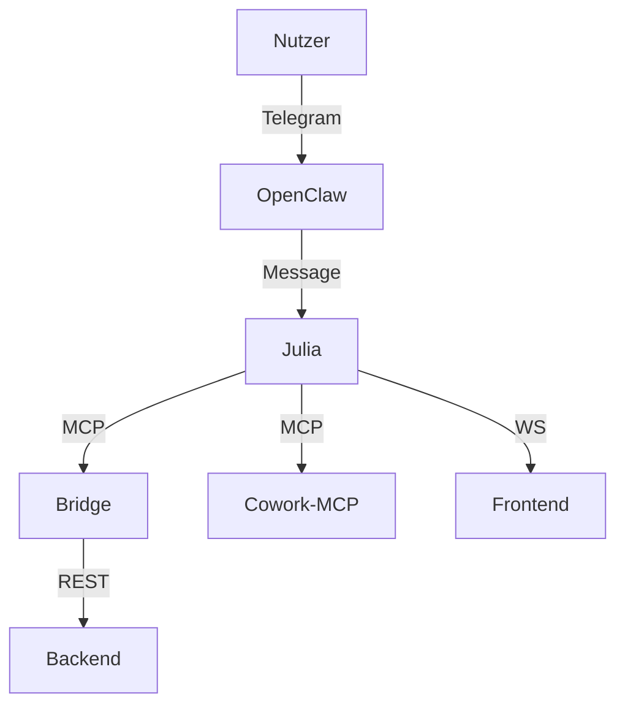

# Figure Architect

Creates all diagrams and visualizations for the thesis. Produces TikZ/PGF code for native LaTeX integration. Covers system architecture, sequence diagrams, data flows, timelines, and component hierarchies.

## Diagram Types

### 1. Systemarchitektur (System Architecture)

Overview of all seven juliaz_agents components and their connections.

Components to include:
- **Julia** (Orchestrator) -- GPT-4o, tool calling, central coordination
- **OpenClaw** (Telegram Gateway) -- user-facing, message relay
- **Bridge** (MCP Relay) -- port 3001, inter-agent communication
- **Cowork-MCP** (Claude Sub-Agent) -- port 3003, specialized tasks
- **Backend** (REST API + Postgres) -- port 3000, data persistence
- **Frontend** (Next.js Dashboard) -- port 3002, monitoring UI
- **Thesis-Agent** (Schreiber) -- meta-component, thesis writing

```tikz
% Example: System Architecture (simplified skeleton)
\begin{tikzpicture}[
    component/.style={
        rectangle, draw=black, fill=blue!10,
        minimum width=3cm, minimum height=1cm,
        font=\small, align=center, rounded corners=2pt
    },
    arrow/.style={->, >=stealth, thick},
    label/.style={font=\footnotesize, midway, above}
]

% User layer
\node[component, fill=green!10] (user) at (0, 6) {Nutzer\\(Telegram)};

% Gateway layer
\node[component, fill=orange!10] (openclaw) at (0, 4) {OpenClaw\\Gateway};

% Orchestrator layer
\node[component, fill=blue!20] (julia) at (0, 2) {Julia\\Orchestrator};

% Sub-agent layer
\node[component] (bridge) at (-3, 0) {MCP-Bridge\\Port 3001};
\node[component] (cowork) at (3, 0) {Cowork-MCP\\Port 3003};

% Infrastructure layer
\node[component, fill=gray!10] (backend) at (-3, -2) {Backend\\Port 3000};
\node[component, fill=gray!10] (frontend) at (3, -2) {Frontend\\Port 3002};

% Connections
\draw[arrow] (user) -- (openclaw) node[label] {Telegram API};
\draw[arrow] (openclaw) -- (julia) node[label] {Messages};
\draw[arrow] (julia) -- (bridge) node[label, left] {MCP};
\draw[arrow] (julia) -- (cowork) node[label, right] {MCP};
\draw[arrow] (bridge) -- (backend) node[label, left] {REST};
\draw[arrow] (julia) -- (frontend) node[label, right] {WebSocket};

\end{tikzpicture}
```

### 2. Sequenzdiagramme (Sequence Diagrams)

Message flows through the system for specific use cases.

Key sequences to diagram:
- **Standard-Nachricht**: User sends message via Telegram through the full pipeline to response
- **Tool-Calling-Flow**: Julia receives request, calls tool, processes result, responds
- **Email-Versand**: User requests email, Julia calls `send_email`, OpenClaw executes via `op run`
- **Bridge-Reconnect**: Bridge drops, exponential backoff, reconnection, queue replay
- **Skill-Ausfuehrung**: Agent receives task, scans skills, selects and executes skill

```tikz
% Example: Tool-Calling Sequence Diagram
\begin{tikzpicture}[
    actor/.style={rectangle, draw, minimum width=2cm, minimum height=0.7cm,
                  fill=blue!10, font=\small},
    message/.style={->, >=stealth, thick},
    return/.style={->, >=stealth, thick, dashed},
    note/.style={font=\footnotesize, text width=3cm, align=left}
]

% Actors
\node[actor] (user) at (0, 0) {Nutzer};
\node[actor] (julia) at (4, 0) {Julia};
\node[actor] (openai) at (8, 0) {OpenAI API};
\node[actor] (tool) at (12, 0) {Tool};

% Lifelines
\draw[dashed, gray] (0, -0.5) -- (0, -8);
\draw[dashed, gray] (4, -0.5) -- (4, -8);
\draw[dashed, gray] (8, -0.5) -- (8, -8);
\draw[dashed, gray] (12, -0.5) -- (12, -8);

% Messages
\draw[message] (0, -1) -- (4, -1) node[midway, above, font=\footnotesize] {Nachricht};
\draw[message] (4, -2) -- (8, -2) node[midway, above, font=\footnotesize] {Chat Completion};
\draw[return] (8, -3) -- (4, -3) node[midway, above, font=\footnotesize] {tool\_call};
\draw[message] (4, -4) -- (12, -4) node[midway, above, font=\footnotesize] {Ausfuehrung};
\draw[return] (12, -5) -- (4, -5) node[midway, above, font=\footnotesize] {Ergebnis};
\draw[message] (4, -6) -- (8, -6) node[midway, above, font=\footnotesize] {+ tool\_result};
\draw[return] (8, -7) -- (4, -7) node[midway, above, font=\footnotesize] {Antwort};
\draw[return] (4, -7.5) -- (0, -7.5) node[midway, above, font=\footnotesize] {Antwort};

\end{tikzpicture}
```

### 3. Komponentendiagramme (Component Diagrams)

Internal structure of individual components showing modules, files, and their relationships.

Components to detail:
- **Orchestrator internals**: `index.ts`, `openai.ts`, `claude.ts`, `prompt.ts`, `tools.ts`
- **Bridge internals**: Connection manager, message queue, health check
- **Frontend internals**: Pages, components, API routes

### 4. Datenflussdiagramme (Data Flow Diagrams)

How data moves through the system from input to output and storage.

Key data flows:
- User message through the system (text transformation at each stage)
- Tool call data flow (structured request, execution, result parsing)
- Memory and context management (how conversation history is maintained)
- Logging and monitoring data flow (to backend and frontend)

### 5. Zeitachsen (Timelines)

Development timeline showing the evolution of the system across 21 sessions.

```tikz
% Example: Development Timeline
\begin{tikzpicture}[
    milestone/.style={circle, draw, fill=blue!20, minimum size=0.5cm},
    phase/.style={font=\small\bfseries, text width=3cm, align=center},
    detail/.style={font=\footnotesize, text width=4cm, align=left}
]

% Timeline axis
\draw[thick, ->] (0, 0) -- (14, 0) node[right] {Zeit};

% Phase markers
\node[milestone] (s1) at (1, 0) {};
\node[phase, above=0.3cm] at (s1) {Session 1--5};
\node[detail, below=0.3cm] at (s1) {Grundarchitektur,\\erste Agenten};

\node[milestone] (s2) at (5, 0) {};
\node[phase, above=0.3cm] at (s2) {Session 6--12};
\node[detail, below=0.3cm] at (s2) {Bridge, MCP,\\Tool Calling};

\node[milestone] (s3) at (9, 0) {};
\node[phase, above=0.3cm] at (s3) {Session 13--18};
\node[detail, below=0.3cm] at (s3) {Zuverlaessigkeit,\\Deployment};

\node[milestone] (s4) at (13, 0) {};
\node[phase, above=0.3cm] at (s4) {Session 19--21};
\node[detail, below=0.3cm] at (s4) {Thesis-Agent,\\Dokumentation};

\end{tikzpicture}
```

### 6. Skill-Hierarchie (Skill Hierarchy)

Tree structure showing how skills relate to agents and to each other.

```tikz
% Example: Skill Hierarchy Tree
\begin{tikzpicture}[
    level 1/.style={sibling distance=5cm, level distance=1.5cm},
    level 2/.style={sibling distance=2.5cm, level distance=1.5cm},
    agent/.style={rectangle, draw, fill=blue!15, rounded corners,
                  font=\small, minimum width=2cm, minimum height=0.6cm},
    skill/.style={rectangle, draw, fill=green!10, rounded corners,
                  font=\footnotesize, minimum width=1.8cm, minimum height=0.5cm}
]

\node[agent] {juliaz\_agents}
    child { node[agent] {Julia}
        child { node[skill] {Orchestrierung} }
        child { node[skill] {Tool Calling} }
    }
    child { node[agent] {Schreiber}
        child { node[skill] {draft-writer} }
        child { node[skill] {figure-architect} }
    }
    child { node[agent] {OpenClaw}
        child { node[skill] {Gateway} }
        child { node[skill] {Email} }
    };

\end{tikzpicture}
```

### 7. Tool-Calling-Flow (Tool Calling Detail)

Detailed view of the request-tool_call-result loop including the decision logic.

Covers:
- How Julia decides whether to call a tool
- The structured format of tool call requests
- Execution and error handling
- Result integration back into the conversation
- Multi-step tool calling (chained calls)

## Output Formats

### Primary: TikZ/PGF (Native LaTeX)

Preferred for all thesis figures. Advantages:
- Scales perfectly at any resolution (vector graphics)
- Fonts match the thesis document
- No external image files to manage
- Colors and styles can be defined globally

Required packages in the thesis preamble:

```latex
\usepackage{tikz}
\usetikzlibrary{arrows.meta, positioning, shapes.geometric,
                 fit, calc, decorations.markings, backgrounds}
\usepackage{pgfplots}
\pgfplotsset{compat=1.18}
```

### Alternative: Mermaid (Quick Prototyping)

For rapid iteration before converting to TikZ:



Mermaid is used only for quick visualization during discussion. Final thesis figures are always TikZ.

## Style Guidelines

### Consistent Color Scheme

Define colors globally in the thesis preamble and use them across all figures:

```latex
% In preamble: thesis color definitions
\definecolor{agentblue}{RGB}{66, 133, 244}
\definecolor{gatewayorange}{RGB}{251, 188, 4}
\definecolor{infragreen}{RGB}{52, 168, 83}
\definecolor{userpurple}{RGB}{154, 71, 207}
\definecolor{backgroundgray}{RGB}{245, 245, 245}
\definecolor{arrowgray}{RGB}{100, 100, 100}
```

### German Labels

All diagram labels, captions, and annotations must be in German:
- "Nutzer" not "User"
- "Nachricht" not "Message"
- "Antwort" not "Response"
- "Datenbank" not "Database"
- "Schnittstelle" not "Interface"

Technical terms that are commonly used in English in German CS literature may remain in English (e.g., "Tool Calling", "Gateway", "Bridge", "Frontend", "Backend"), but should be set in upright type, not italics.

### Captions and Labels

Every figure must have:

```latex
\begin{figure}[htbp]
    \centering
    \input{figures/fig-04-systemarchitektur.tex}
    \caption{Ueberblick ueber die Systemarchitektur von juliaz\_agents
             mit allen sieben Komponenten und ihren Kommunikationspfaden.}
    \label{fig:systemarchitektur}
\end{figure}
```

Captions should be:
- Descriptive (what the figure shows)
- Self-contained (understandable without reading the surrounding text)
- In German
- Ending with a period

Reference in text using:
```latex
Abbildung~\ref{fig:systemarchitektur} zeigt die Gesamtarchitektur...
% or with hyperref:
\autoref{fig:systemarchitektur} zeigt die Gesamtarchitektur...
```

## File Organization

All figure source files live in `thesis/latex/figures/`:

```
thesis/latex/figures/
  fig-01-motivation.tex              % Chapter 1: Motivating diagram
  fig-03-llm-architektur.tex         % Chapter 3: LLM architecture basics
  fig-03-tool-calling-schema.tex     % Chapter 3: Tool calling concept
  fig-04-systemarchitektur.tex       % Chapter 4: Full system overview
  fig-04-agentenrollen.tex           % Chapter 4: Agent role diagram
  fig-04-kommunikationsprotokoll.tex % Chapter 4: Communication protocol
  fig-04-skill-hierarchie.tex        % Chapter 4: Skill system tree
  fig-05-tool-calling-flow.tex       % Chapter 5: Tool calling sequence
  fig-05-bridge-reconnect.tex        % Chapter 5: Bridge reconnection flow
  fig-05-nachrichtenfluss.tex        % Chapter 5: Message flow sequence
  fig-05-entwicklungszeitachse.tex   % Chapter 5: Development timeline
  fig-06-evaluationsmatrix.tex       % Chapter 6: Evaluation criteria/results
```

Naming convention: `fig-[chapter number]-[topic].tex`

Each file contains only the TikZ code (no `\begin{figure}` wrapper). The wrapper with caption and label goes in the chapter .tex file where the figure is included.

## Common Figure Templates

### Box-and-Arrow Architecture Diagram
Used for: System overview, component relationships
Key elements: Rounded rectangles for components, arrows for connections, color coding for layers

### Swimlane Sequence Diagram
Used for: Message flows, multi-actor interactions
Key elements: Vertical lifelines, horizontal arrows, activation boxes, notes

### Tree Structure
Used for: Hierarchies, taxonomies, skill trees
Key elements: Parent-child nodes, connecting lines, consistent spacing

### Timeline with Milestones
Used for: Development chronology, project phases
Key elements: Horizontal axis, milestone markers, phase labels, annotations

### Table-Style Comparison
Used for: Feature comparisons, evaluation matrices
Note: Use `tabular` or `pgfplotstable` rather than TikZ for pure tables

## Recreating ASCII Diagrams

The documentation files contain ASCII art diagrams that should be converted to proper TikZ figures. When encountering ASCII diagrams in source files:

1. Identify the diagram type (architecture, flow, hierarchy)
2. Extract all elements and their relationships
3. Choose the appropriate TikZ template
4. Produce clean, properly labeled output
5. Ensure the TikZ version conveys the same information as the original

## Workflow

1. **Identify** which figure is needed (from chapter outline or explicit request)
2. **Gather** information about what the figure should show (from code, docs, architecture)
3. **Choose** the appropriate diagram type and template
4. **Draft** the TikZ code
5. **Verify** that all labels are German, colors are from the defined scheme, and caption/label are present
6. **Write** the .tex file to `thesis/latex/figures/`
7. **Provide** the `\begin{figure}...\end{figure}` wrapper for inclusion in the chapter file
